# 三盟软件新框架服务器环境及应用部署方案

## 服务器IIS功能添加
### 进入服务器管理器
点击‘开始’菜单，单击服务器管理器

### 添加角色和功能向导

在服务器管理器中点击‘添加角色和功能’，开始安装

### 安装类型

选择‘基于角色或基于功能的安装’，点击下一步

### 服务器选择
选中‘从服务器池中选择服务器’，并选中服务器，点击下一步

### 服务器角色

选择‘Web服务器（IIS）’，添加Web服务器(IIS)所需的功能->单击"增加功能"，点击下一步

### 功能
勾选‘.Net Framework 3.5功能’下所有功能，在弹窗中，添加对应的所需功能

勾选‘.Net Framework4.6功能’下的所有功能，在弹窗中，添加对应的所需功能

勾选‘IIS可承载Web核心’点击下一步

### Web服务器角色（IIS）
点击下一步

### 角色服务
‘Web服务器’目录下的服务全选，点击下一步

### 确认安装内容
本次安装未选择‘安装完成后自动重启目标服务器’，系统配置完成后，手动重启服务器，点击‘安装’，开始安装

### 安装完成

## Mysql数据库还原（可选）
根据应用实际使用的数据库进行选择，Mysql数据库安装本文档中不做介绍，该处主要介绍mysql数据库还原

1、安装Navicat（默认选项安装），收费软件（试用14天），打开软件，连接-mysql

2、输入连接名，主机地址，账号密码，确定连接数据库

3、新建数据库

选择新建数据库的字符集及排序规则（如下）

4、打开备份目录，将备份文件复制进去，刷新

5、选中需要还原的备份文件，点击‘还原备份’

## SQL Server数据库安装
安装包中setup.exe文件，双击安装，选择：全新安装或现有安装添加功能

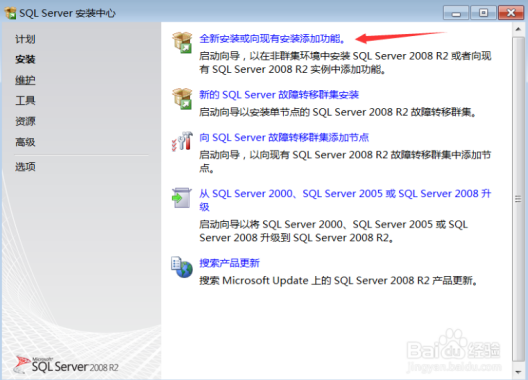
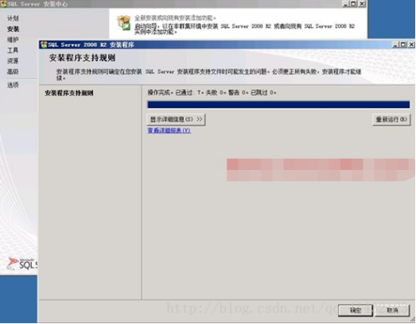

点击确认

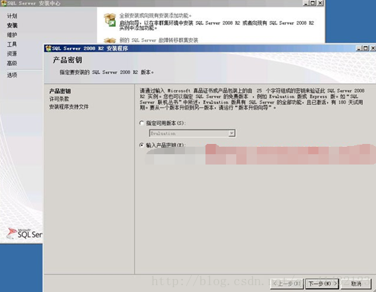

输入产品密钥，点击下一步

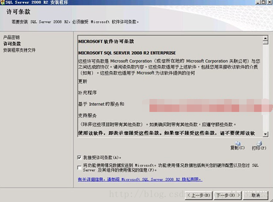

接受许可条款，下一步

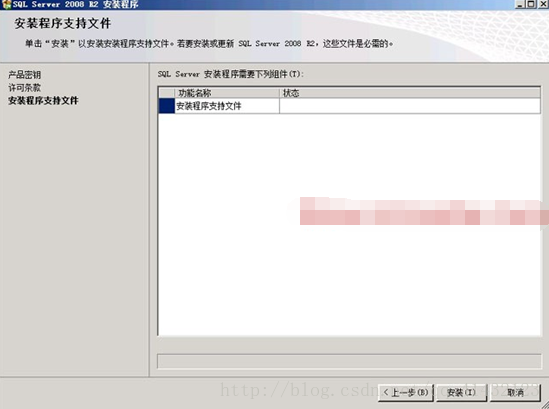

点击安装

### 安装程序支持规则

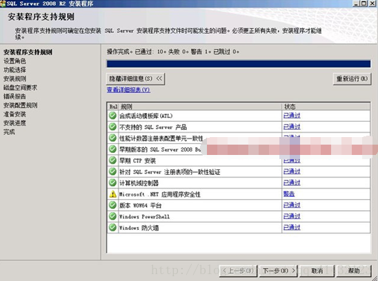

### 设置角色

选择SQL Server功能安装

### 功能选择

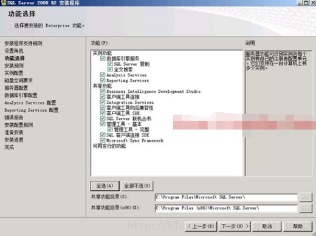

根据实际需求选择具体功能，这里点全选，安装所有组件，安装路径默认，如若需要安装多个sqlserver实例，自行更改目录

### 安装规则

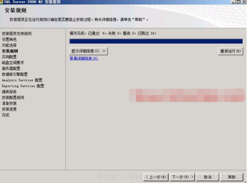

### 实例配置

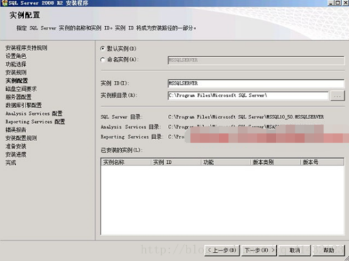

使用默认实例名，如若需要安装多个实例，则自行修改实例名和路径

### 磁盘空间需求

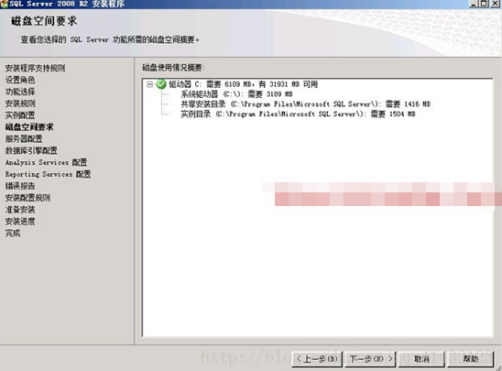

### 服务器配置

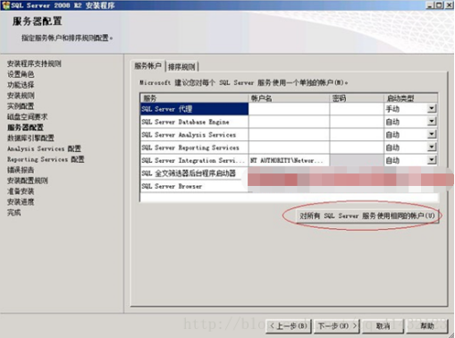

服务账户设置，选择对所有SQL Server服务使用相同的账户（双击打开）
输入服务器系统的账户和密码

### 数据库引擎配置

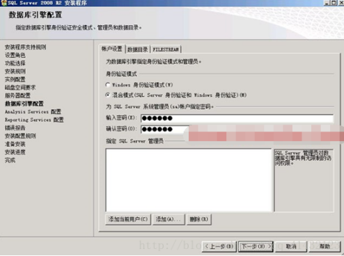

身份验证模式选择‘混合模式’，输入并确认SA账户的密码，在指定SQL Server管理员中，添加当前用户，下一步

### Analysis Services配置

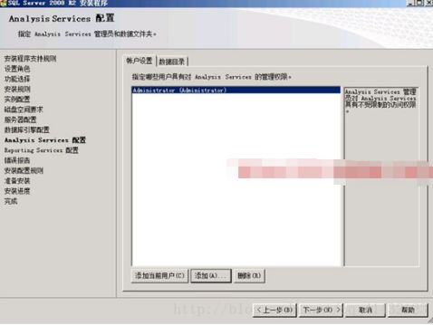

在账户设置中，添加当前用户，下一步

### Reporting Services配置

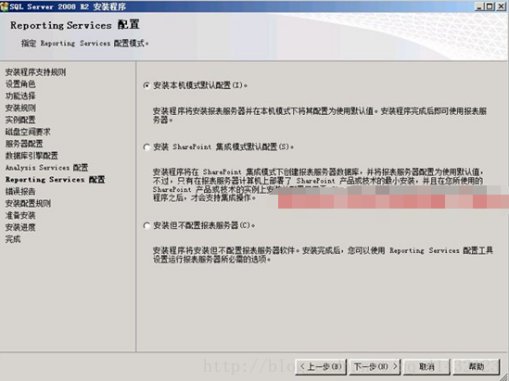

### 错误报告

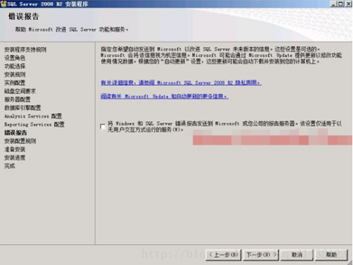

### 安装配置规则

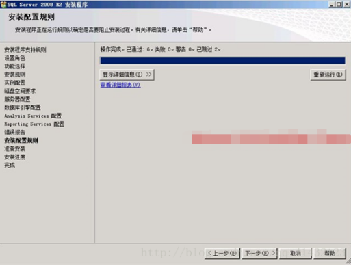

### 准备安装

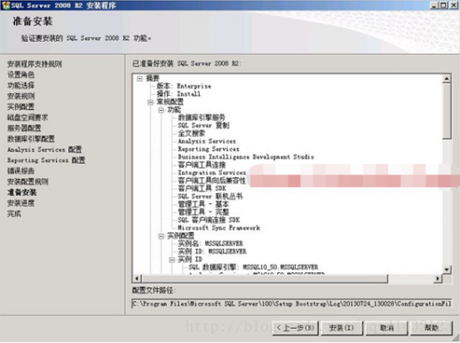

### 安装进度

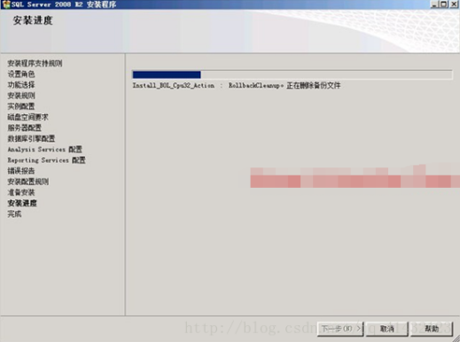

### 完成

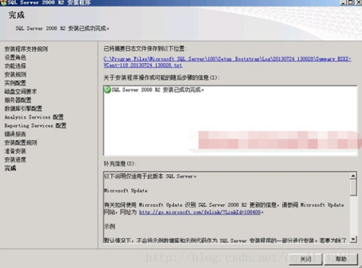

## SQL Server数据库还原
### 数据库登录
打开SQL Server Management Studio，直接采用Windows身份验证，服务器名称‘.’（代表本地），点击连接，如若需要使用账号登录，则将身份验证设置为‘SQL Server身份验证’，并输入账号和密码

### 数据库还原
登录SQL Server后，右键点击数据库--还原数据库，在目标数据库填写数据库名称，还原的源中选择源设备，并打开已经备份好的BAK文件，在‘选择用于还原的备份集’中，勾选需要还原的备份集，点击确认开始还原
（如若需要还原的数据库已经存在，则在该数据库上右键--任务--还原--数据库，在选项中，勾选‘覆盖现有数据库’）

还原后的数据库

右键点击数据库--属性，在左侧‘选择页’中，选择文件，点击‘所有者’后面的展开按钮--浏览--选择该数据库的所有者账户，确认后保存

## 应用部署
### Redis安装
推荐版本Redis-x64-3.2.100

### .Net Framework 4.5安装
官方下载.Net Framework 4.5安装包，默认选项进行安装
（以Windows Server 2008R2为例，如若是Windows Server 2012R2或Windows Server 2016，系统自带.Net Framework 4.5及更高版本，无需安装.Net Framework 4.5）

### IIS站点发布
1、Web服务器打开iis-添加网站（提前将IIS中默认占用80端口的站点删除）

2、在内容目录--物理路径中选择应用代码目录，绑定类型默认为http，端口为80，点击确认后完成网站添加（端口根据实际需求自行调整）

3、应用程序池中，双击新建站点对应的应用程序池，将.Net Framework版本设置为.Net Framework v4.0.30319，点击确认，

4、应用程序池中，选中新建站点对应的应用程序池，点击右侧‘操作’栏的‘高级设置’，将‘启用32位应用程序’设置为‘True’，完成后点击确认

至此，web应用部署完成，IIS中点击浏览网站或者在浏览器中输入 http://localhost 均可访问到该站点（如自行修改过端口，则访问 http://localhost 是，后面需要添加端口号，用‘:’分隔）

### 数据库连接
#### SQL Server数据库连接

在应用代码文件目录中，编辑XmlConfig文件夹中的database.config文件
connectionString中，Server=服务器地址（IP）；Initial Catalog=数据库名称；User包含数据库账户信息（ID和Password），编辑完成后保存退出。

#### Mysql数据库连接

在应用代码文件目录中，编辑XmlConfig文件夹中的database.config文件
connectionString中，Server=服务器地址（IP）；User包含数据库账户信息（ID和Password）；database=数据库名称；charset根据实际情况做调整，编辑完成后保存退出。

