# 三盟软件新框架服务器环境及应用部署方案

## 服务器IIS功能添加
### 进入服务器管理器
点击‘开始’菜单，单击服务器管理器

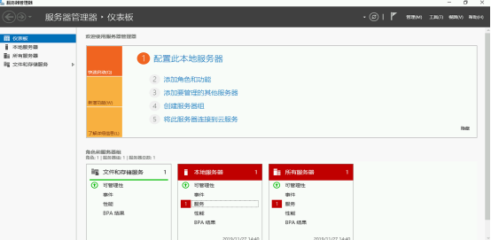

### 添加角色和功能向导

在服务器管理器中点击‘添加角色和功能’，开始安装

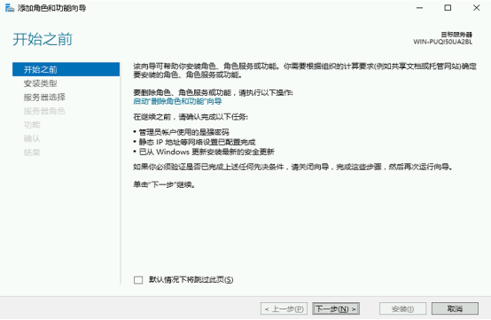

### 安装类型

选择‘基于角色或基于功能的安装’，点击下一步

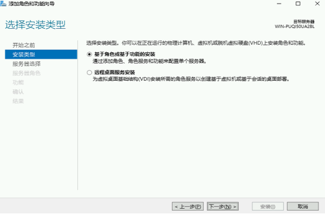

### 服务器选择
选中‘从服务器池中选择服务器’，并选中服务器，点击下一步

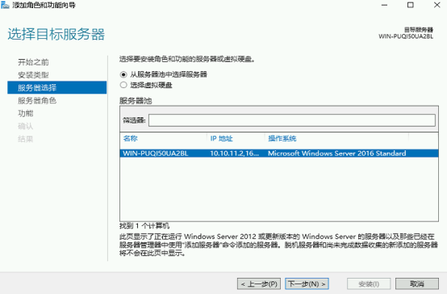

### 服务器角色

选择‘Web服务器（IIS）’，添加Web服务器(IIS)所需的功能->单击"增加功能"，点击下一步

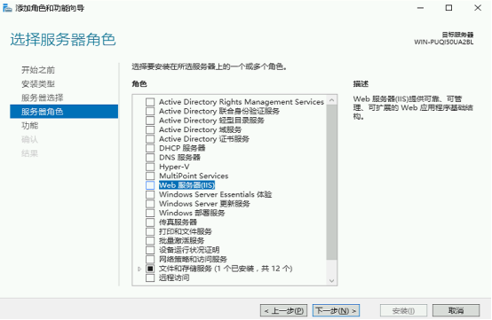
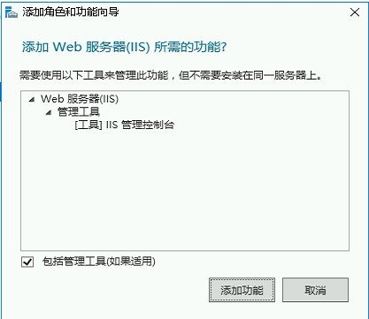

### 功能
勾选‘.Net Framework 3.5功能’下所有功能，在弹窗中，添加对应的所需功能

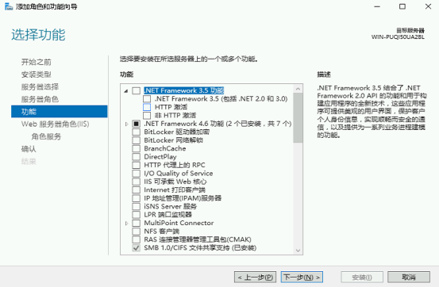
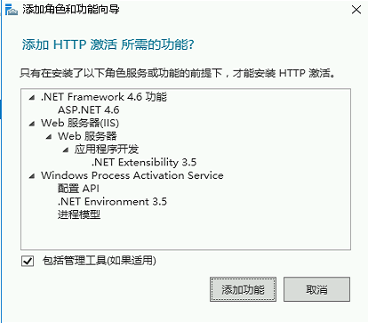

勾选‘.Net Framework4.6功能’下的所有功能，在弹窗中，添加对应的所需功能

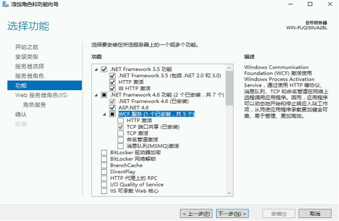

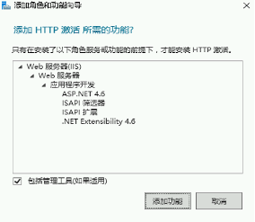

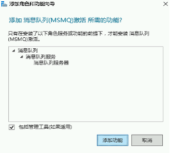

勾选‘IIS可承载Web核心’点击下一步

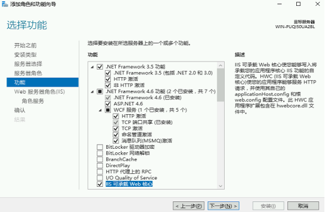

### Web服务器角色（IIS）
点击下一步

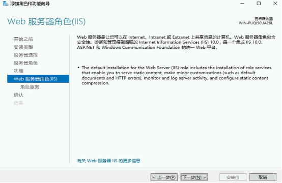

### 角色服务
‘Web服务器’目录下的服务全选，点击下一步

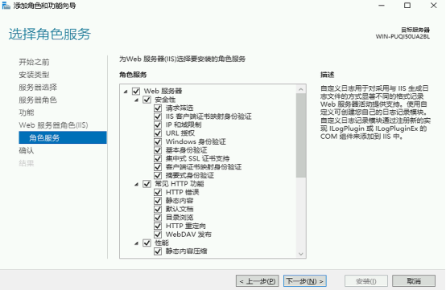

### 确认安装内容
本次安装未选择‘安装完成后自动重启目标服务器’，系统配置完成后，手动重启服务器，点击‘安装’，开始安装

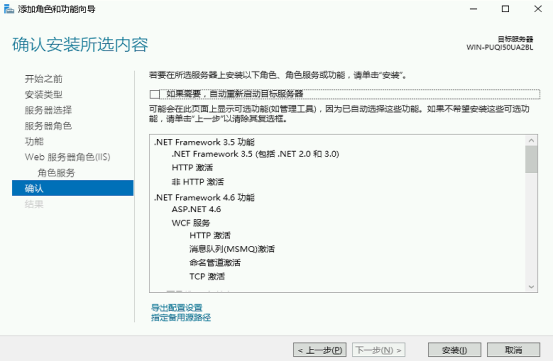

### 安装完成

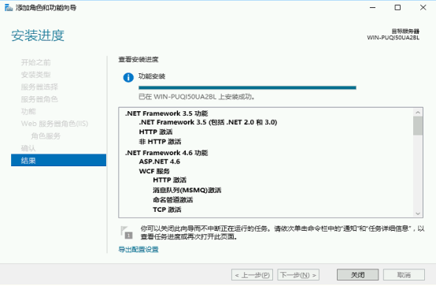
