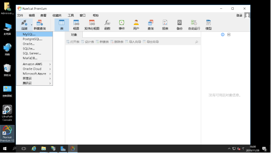
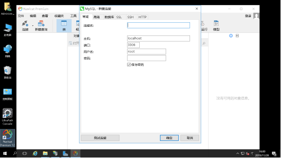
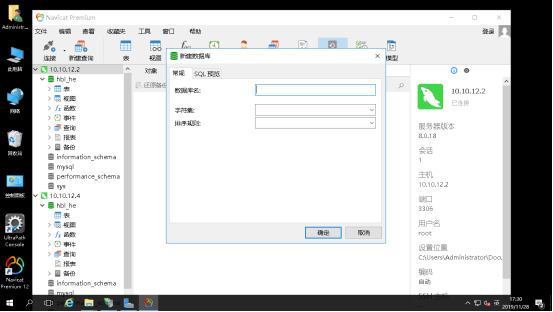
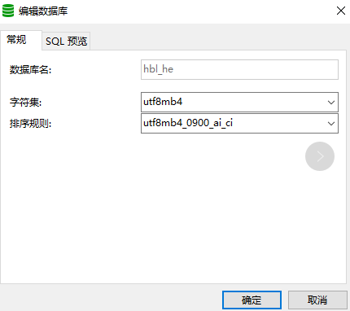
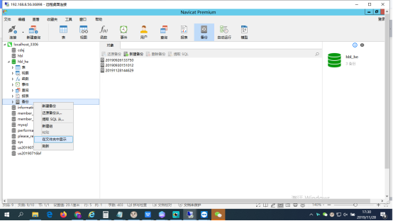
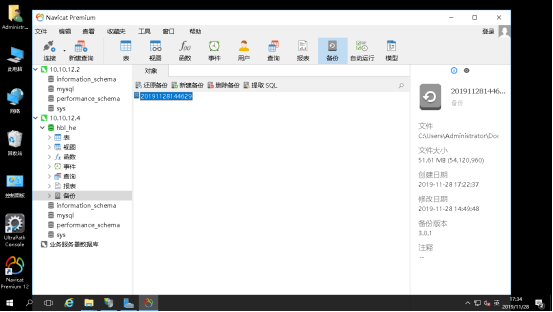

# 三盟软件新框架服务器环境及应用部署方案

## Mysql数据库还原（可选）
根据应用实际使用的数据库进行选择，Mysql数据库安装本文档中不做介绍，该处主要介绍mysql数据库还原

1、安装Navicat（默认选项安装），收费软件（试用14天），打开软件，连接-mysql

2、输入连接名，主机地址，账号密码，确定连接数据库

3、新建数据库

选择新建数据库的字符集及排序规则（如下）

4、打开备份目录，将备份文件复制进去，刷新

5、选中需要还原的备份文件，点击‘还原备份’

