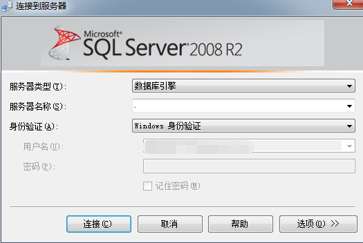
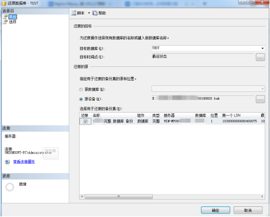
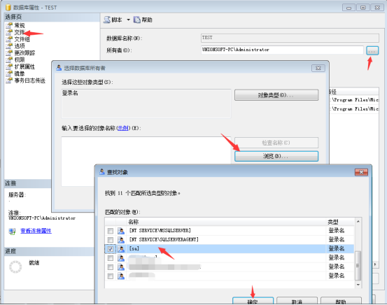

### 数据库登录
打开SQL Server Management Studio，直接采用Windows身份验证，服务器名称‘.’（代表本地），点击连接，如若需要使用账号登录，则将身份验证设置为‘SQL Server身份验证’，并输入账号和密码

### 数据库还原
登录SQL Server后，右键点击数据库--还原数据库，在目标数据库填写数据库名称，还原的源中选择源设备，并打开已经备份好的BAK文件，在‘选择用于还原的备份集’中，勾选需要还原的备份集，点击确认开始还原
（如若需要还原的数据库已经存在，则在该数据库上右键--任务--还原--数据库，在选项中，勾选‘覆盖现有数据库’）

还原后的数据库

右键点击数据库--属性，在左侧‘选择页’中，选择文件，点击‘所有者’后面的展开按钮--浏览--选择该数据库的所有者账户，确认后保存

