### SQL Server启动安装程序
安装包中setup.exe文件，双击安装，选择：全新安装或现有安装添加功能

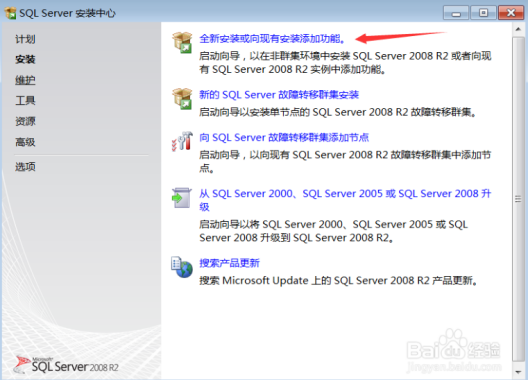
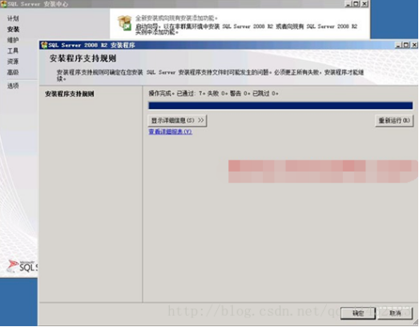

点击确认

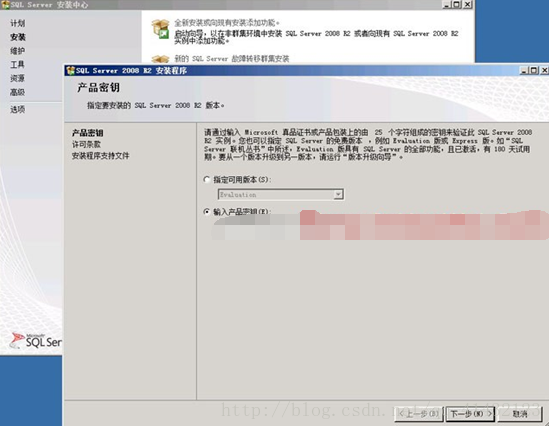

输入产品密钥，点击下一步

接受许可条款，下一步

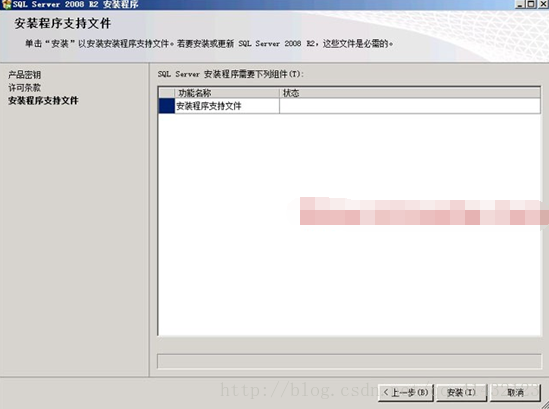

点击安装

### 安装程序支持规则

### 设置角色

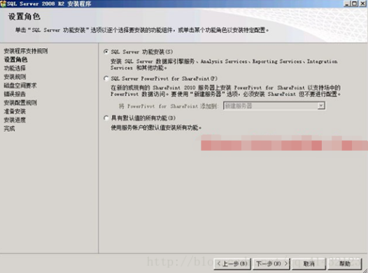

选择SQL Server功能安装

### 功能选择

根据实际需求选择具体功能，这里点全选，安装所有组件，安装路径默认，如若需要安装多个sqlserver实例，自行更改目录

### 安装规则

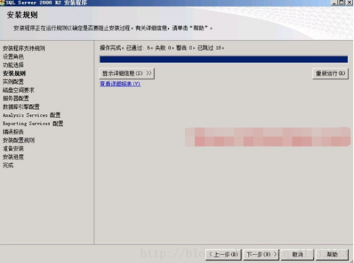

### 实例配置

使用默认实例名，如若需要安装多个实例，则自行修改实例名和路径

### 磁盘空间需求

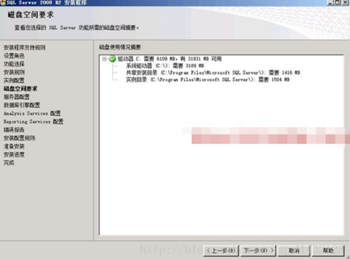

### 服务器配置

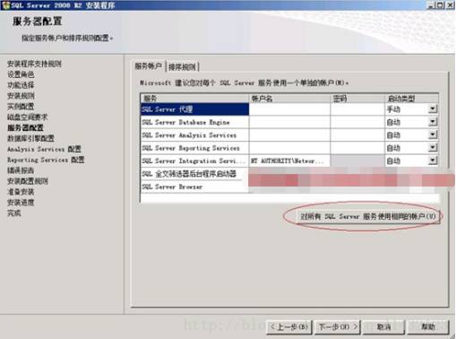

服务账户设置，选择对所有SQL Server服务使用相同的账户（双击打开）
输入服务器系统的账户和密码

### 数据库引擎配置

身份验证模式选择‘混合模式’，输入并确认SA账户的密码，在指定SQL Server管理员中，添加当前用户，下一步

### Analysis Services配置

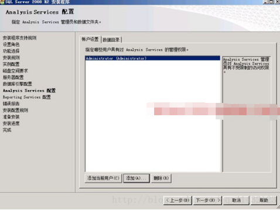

在账户设置中，添加当前用户，下一步

### Reporting Services配置

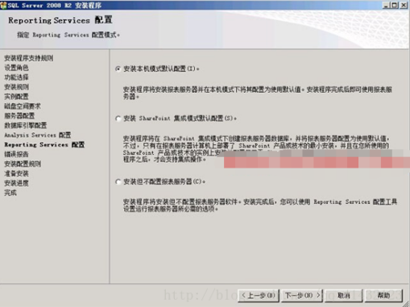

### 错误报告

### 安装配置规则

### 准备安装

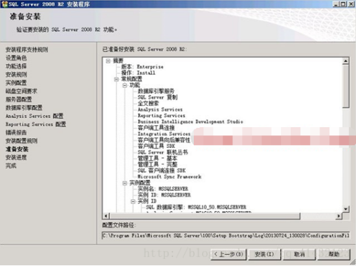

### 安装进度

### 完成

