# 三盟软件新框架服务器环境及应用部署方案

## 应用部署
### Redis安装
推荐版本Redis-x64-3.2.100

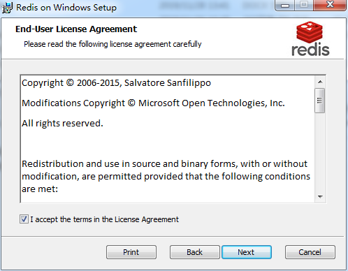

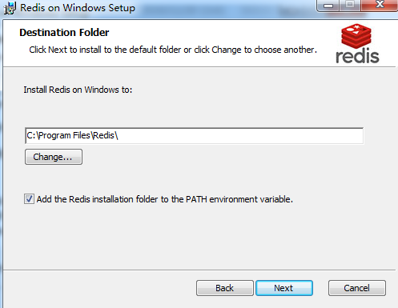

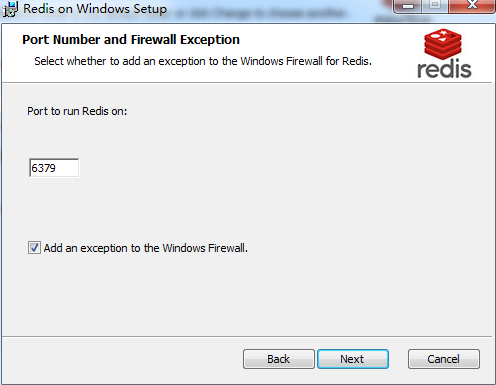

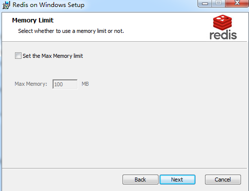

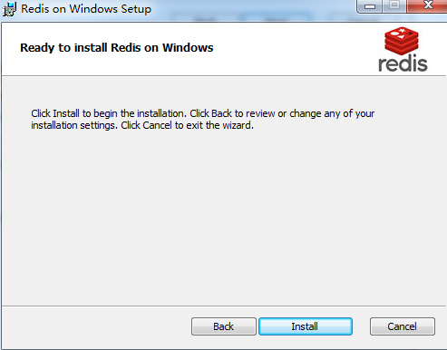

### .Net Framework 4.5安装
官方下载.Net Framework 4.5安装包，默认选项进行安装
（以Windows Server 2008R2为例，如若是Windows Server 2012R2或Windows Server 2016，系统自带.Net Framework 4.5及更高版本，无需安装.Net Framework 4.5）

### IIS站点发布
1、Web服务器打开iis-添加网站（提前将IIS中默认占用80端口的站点删除）

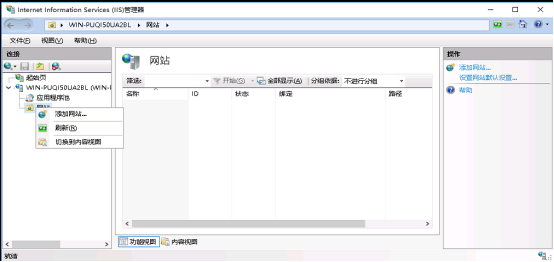

2、在内容目录--物理路径中选择应用代码目录，绑定类型默认为http，端口为80，点击确认后完成网站添加（端口根据实际需求自行调整）

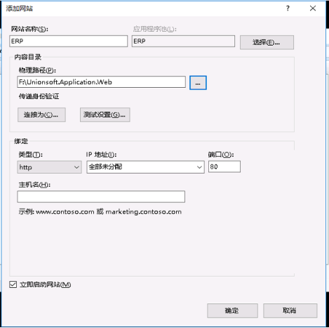

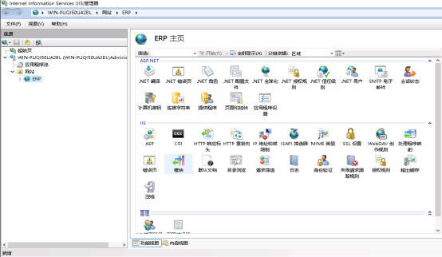

3、应用程序池中，双击新建站点对应的应用程序池，将.Net Framework版本设置为.Net Framework v4.0.30319，点击确认，

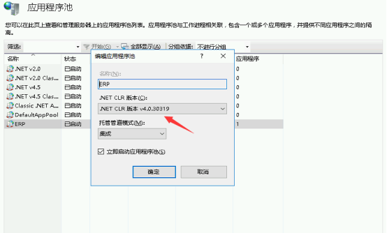

4、应用程序池中，选中新建站点对应的应用程序池，点击右侧‘操作’栏的‘高级设置’，将‘启用32位应用程序’设置为‘True’，完成后点击确认

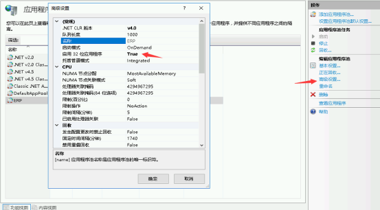

至此，web应用部署完成，IIS中点击浏览网站或者在浏览器中输入 http://localhost 均可访问到该站点（如自行修改过端口，则访问 http://localhost 是，后面需要添加端口号，用‘:’分隔）

### 数据库连接
#### SQL Server数据库连接

在应用代码文件目录中，编辑XmlConfig文件夹中的database.config文件
connectionString中，Server=服务器地址（IP）；Initial Catalog=数据库名称；User包含数据库账户信息（ID和Password），编辑完成后保存退出。

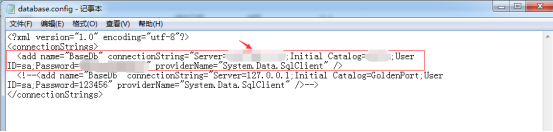

#### Mysql数据库连接

在应用代码文件目录中，编辑XmlConfig文件夹中的database.config文件
connectionString中，Server=服务器地址（IP）；User包含数据库账户信息（ID和Password）；database=数据库名称；charset根据实际情况做调整，编辑完成后保存退出。

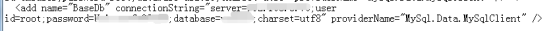
